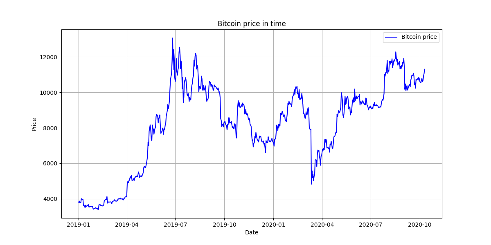
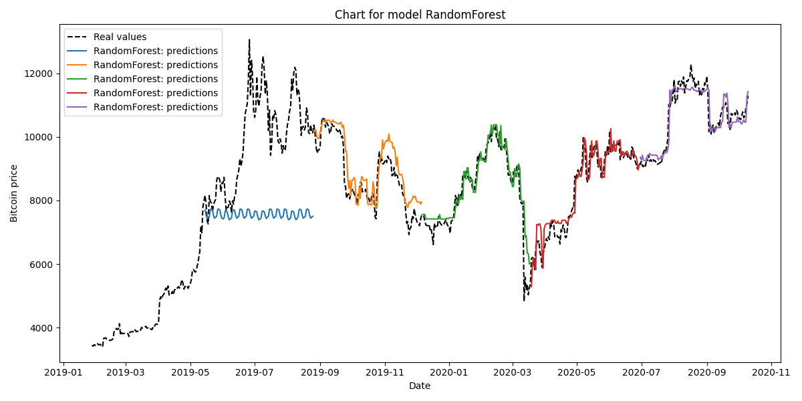
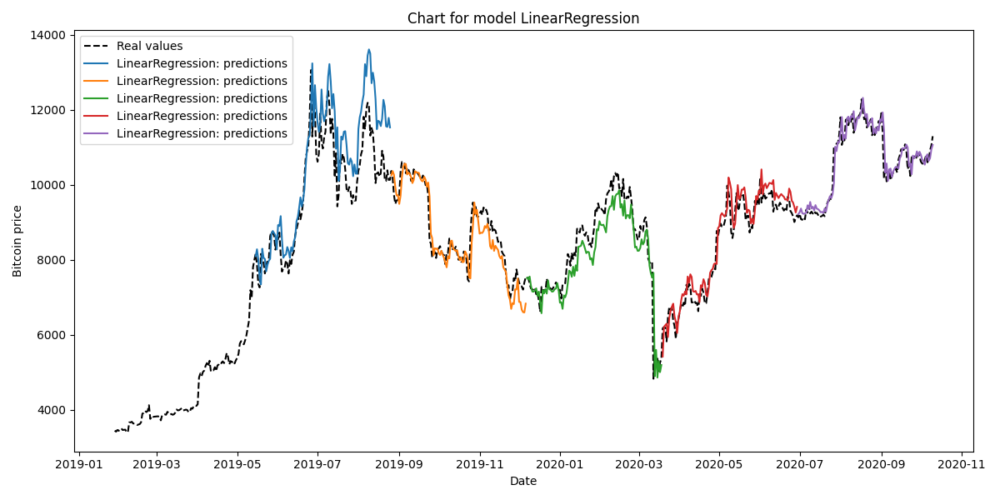
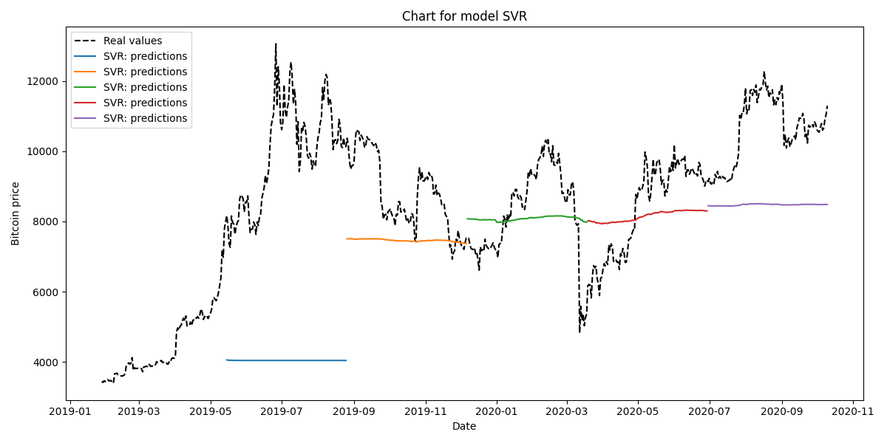
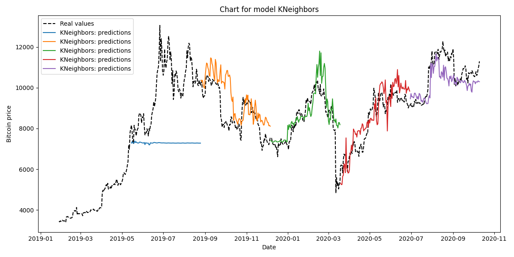
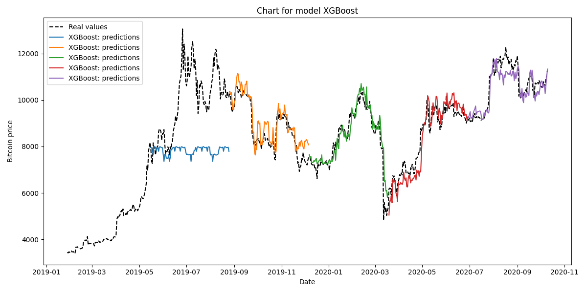

# Bitcoin Price Prediction

Machine learning pipeline for Bitcoin price forecasting using time-series feature engineering and cross-validation.

## Features

- Calendar-based features (`year`, `month`, `day`, `weekday`)
- Cyclical encoding (`sin`, `cos`)
- Lag features (`1`, `3`, `7`, `14` days)
- Rolling mean features

## Models

- Linear Regression
- Lasso Regression
- Support Vector Regression (SVR)
- K-Nearest Neighbors
- Random Forest Regressor
- XGBoost Regressor

## Validation

Time-series cross-validation:

```python
TimeSeriesSplit(n_splits=5)
```

## Metrics

- R²
- MAE
- RMSE

## Visualizations

### Historical Bitcoin Price



### Random Forest Predictions

Comparison of actual Bitcoin prices and predictions generated by the Random Forest model across all cross-validation folds.



## Prediction Charts

### Linear Regression



### Lasso Regression


### Support Vector Regression



### K-Nearest Neighbors



### Random Forest


### XGBoost



## Tech Stack

- Python
- Pandas
- NumPy
- Matplotlib
- Scikit-learn
- XGBoost

## Project Structure

```text
.
├── data
│   └── bitcoin.csv
├── figures
│   └── bitcoin.png
├── src
│   └── bitcoin-prediction.py
├── .gitignore
├── README.md
└── requirements.txt
```

## Run

```bash
pip install -r requirements.txt
python bitcoin-prediction.py
```
